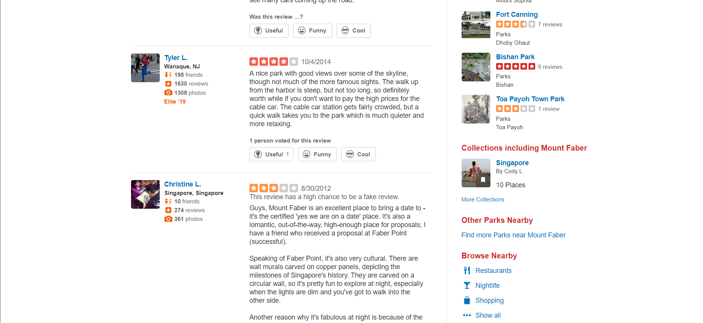
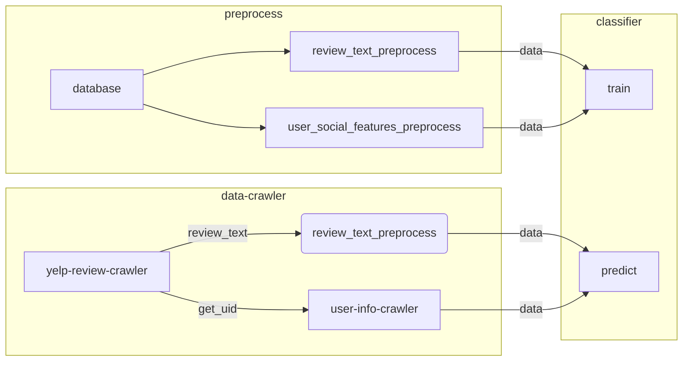

Yhelper: FAKE Review Detection & Applications
=======================

(C) 2019 Lee Sze Wei (A0180783X) & Wang Huaqiang (A0196556M)

[TOC]

# 1. Description

This project aims to detect fake reviews on Yelp from sentiment features and user's social features. The form of this application will be a browser extension. When users browse reviews and grades on Yelp, the extension will point out potential fake reviews.

After enabling this extension on your web browser, the Yelp website will be like this:



# 2. Technology Used

* Sentiment analysis. 
* Fake user detection. 
* Profile level behavioral analysis.

# 3. Targeted audience

People who wants to know about a business from its remarks and grades on Yelp.

# 4. Program Structure

## Core classifier



TODO: File introduction and comments.

## Modules Explanation

Preprocess:

* yelpdbreader.py 
* preprocess_db.py
* preprocess_review.py
* vader_awmod.py

Runtime data crawler:

* pageparser.py
* user_crawler.py

Classifier:

* classifier.py

Chrome Extension:
* Client Side:
    * ./extension
* Server Side(demo):
    * server.py
<!-- * get_additional_data.py -->

# 5. Usage

## 5.1. Local version

The local version requires `python2.7` with `sklearn`, `xgb`, and `nltk`. To run the chrome extension and the website, a web framework `flask` is also needed. You can install them via pip.

```
pip install sklearn
pip install xgb
pip install nltk
pip install flask
```

To do preprocess, run:
```
python preprocess_db.py
python preprocess_review.py
```

Warning: `preprocess_review.py` will take a long time to finish.

To train classifier, run:
```
python classifier.py
```

The trained model will be saved in `model1.data`, `model2.data` and `tfidf-model.data` in `data` folder.

To detect fake reviews from a yelp page, call (in python):
```py
import pageparser
pageparser.detect_fake_review(url)
```

To call pre-trained classifier, call (in python):
```py
import classifier
classifier.load_model()
classify_result=classifier.check(reviews)
# see classifier.py for the structure of `reviews`
```

You can run:
```
python pageparser.py
```

To run a built-in fake reviews detection unit test. 

For debug: the result will be saved in:
```
./data/preprocessed/yelppage.json
./data/preprocessed/new_yelppage.htm
```

## Website

TBD

## Browser Extension

TBD

<!-- Replace the page now. -->

In real world, this extension should query result from server database, and will use Ajax to update webpage dynamically.

For simplify, the chrome extension will now replace yelp page with a local version. 

The structure of 

### Usage

#### Server Side

```py
# in python 2.7 environment, run:
python server.py
```

The server will output the result in stdout when receiving requests from the extension. 

#### Client Side

```
# input the following URL in Chrome's multifunction bar.
chrome://extensions/

# enable developer mode
# `Load Unpacked`
# choose directory: `......\Yhelper\extension`

# This extension is only available when you are visiting yelp detail page. Click the extension icon and click run script button. It will take some time for the server to crawl and run the classifier.
```

# Reference

[1] Hutto, C.J. & Gilbert, E.E. (2014). VADER: A Parsimonious Rule-based Model for Sentiment Analysis of Social Media Text. Eighth International Conference on Weblogs and Social Media (ICWSM-14). Ann Arbor, MI, June 2014.

---

<!-- # Raw Data -->

UF user feature 
RF review feature
TF review text feature 
TFS review text feature: sentiment score 

TF+TFS+UF sgd+xgb
Average Precision is 0.802979.
Average Recall is 0.717550.

Average Precision is 0.805863.
Average Recall is 0.717305.

TF+TFS+UF+RF sgd+xgb
Average Precision is 0.804181.
Average Recall is 0.713945.

Average Precision is 0.810476.
Average Recall is 0.726868.
little improvement

<!-- --- -->

TODO:

Doc(5-6h): test!!!
Chisel!!!!! Sat night/Sun 
Parallel (5-6h?)
GD (almost finished)


<!-- * More Features
* Enhance Classifier
* JS: Alter webpage
* Server: Deal with http get
* Extension: use JS -->


<!-- Include userid
Mainly NLP?

get all the remarks together

Can not introduce other info.

train a basic model

Try to introduce more info: get data from yelp

A plugin?

https://www.cs.uic.edu/~liub/FBS/fake-reviews.html

Building a Sentiment Summarizer
for Local Service Reviews

https://ryanmcd.github.io/papers/local_service_summ.pdf


## 5.2. Features we can get

### 5.2.1. From Profile

* Photo
* Friends
* Reviews
* Photos
* Yelp Elite
* Location
* Rating Distribution
* Review Votes
    * Useful 455
    * Funny 161
    * Cool 313
* Stats
    * Tips 207
    * Review Updates 5
    * Events Submitted 20
    * Firsts 172
    * Followers 2
    * Lists 11
* Yelping Since
* Things I Love (Need NLP)
* My Blog Or Website

TBD: extract feature using a script.

### 5.2.2. User relationship: Graph model

Hard to do...

### 5.2.3. From the reviews

LIWC

## 5.3. Ideas from the paper

What Yelp Fake Review Filter Might Be Doing? -->