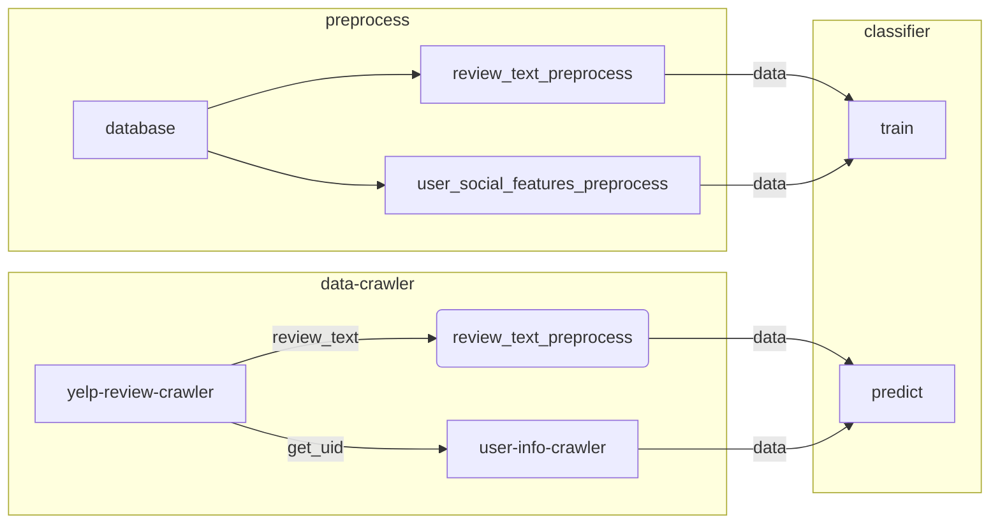
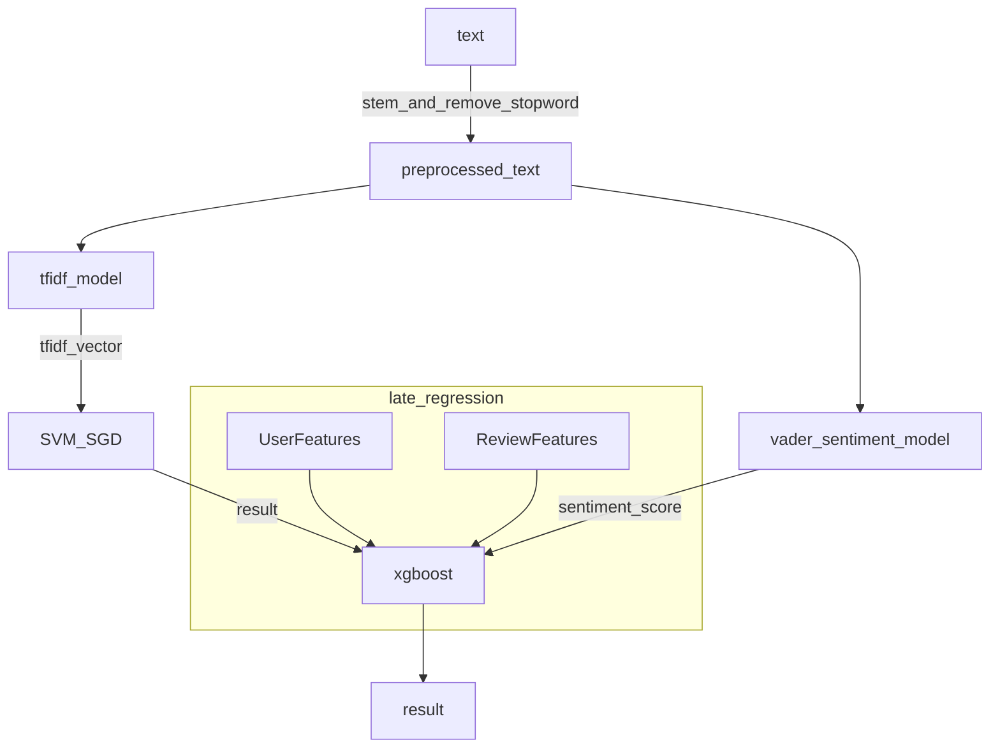

Yhelper
=======================

FAKE Review Detection & Applications

* Wang Huaqiang (A0196556M) 
* Lee Sze Wei (A0180783X) 

---

## 1. Description

This project aims to detect fake reviews on Yelp from sentiment features and user's social features. The form of this application will be a browser extension. When users browse reviews and grades on Yelp, the extension will point out potential fake reviews.

---

## 2. Technology Used

* Sentiment analysis. 
* Fake user detection. 
* Profile level behavioral analysis.

---

## 3. Dataset

The dataset consists of Yelp hotel database holding the below tables:

* i.	Hotel
* ii.	Review
* iii.	Reviewer

---

## 4. Targeted audience

This application has 2 target groups:

1. Potential customers who are interesting to use book the hotels listed
2. Hotel management who are concerned about fake negative reviews submitted on their hotels, which has possibly led to loss of potential business


---

## Demo

* Classifier
* Extension
* Website

---

## 6. Program Structure

#### 6.1. Training and predicting



#### 6.2. The whole project

```mermaid
graph LR

classifier
database

subgraph model_training
local_cls_trainer
end

subgraph result_page
todo
end

subgraph database
database
marked_data_database
end

subgraph chrome_ext
server_side--url-->client_side
client_side--result-->server_side
end

marked_data_database-->local_cls_trainer
database-.->client_side
local_cls_trainer--train-->classifier
client_side--call-->crawler
client_side-.lookup.->database
classifier--clf_result-->client_side
crawler--data-->classifier
classifier--result-->database
database-->todo
```

Notes: Dotted line in graph means it shows the data flow in real scene. Solid line in graph means it is the real data flow in live demo.

---

## 7. Details of Classifier

#### 7.1. Core classifier



As the graph shows, this model is mainly a two level model. Review text, after stemming and vectorizing, will be send to a SVM classifier, it will generate a classify result. In the mean time, a rule based sentiment analyzer will give out the sentiment score for a review. Then we do a late fusion on all the features, we gather user features, review features (see the table below), sentiment score, SVM result together, and use the xgboost model to do the final job.

#### 7.2. Notations

* UF: user features, eg: the friend number of a reviewer
* RF: review features, eg: the number of Useful/Cool remark for a review 
* TF: review text features 
* TFS: review text feature: sentiment score
* SG: complex social feature (social graph, etc.), eg: ave friend count of a review's friends/if the reviewer has a friend who has a high chance to be a fake review maker.

<!-- TODO -->


<!-- TODO: -->

#### 7.3. Full features list

Following is a list of all the features that we have tried. Not all of them are used in the final model.

Feature type|Feature name|Notes
-|-|-
TF|tf-idf_vector|-
TFS|vader sentiment score|- 
RF|grade|the grade the reviewer gave
RF|useful|`useful` in RF means "how many people think **this review** is useful"
RF|cool|ditto
RF|funny|ditto
RF|total_votes|total_votes=useful+cool+funny
UF|useful|`useful` in RF means "how many **useful** has this reviewer gotten in total"
UF|cool|ditto
UF|funny|ditto
UF|total_votes|total_votes=useful+cool+funny
UF|firsts|How many times has the reviewer been the first one to review on some place. 
UF|yelp_time_abs|yelp_time_abs=current_year-join_yelp_year
UF|compliment|We can not get compliment from a yelp crawler. We have to used yelp openDB or other ways. 
UF|tips|-
UF|friends|-
UF|followers|-
UF|photos|The number of photos the user have sent.

<!-- TODO -->

#### 7.4. Training Procedure 

<!-- According to the experience in Lab1, this implementation uses SVM as the basic classifier for emojis. As predictions can not be made only using features like retweet_count, `xx_count` will be introduced in the stacking classifier (Xgboost classifier). -->

###### 7.4.1. Parameter Tune

This implementation uses `GridSearchCV` to tune parameters. In `classifier.py` the parameters were already tuned and hard coded. You can refer to `Usage` in this document to tune parameters manually.

###### 7.4.2. Training

The training procedure includes: 

1. Get the tf-idf model for review text.
1. Training the SVM classifier for review text.
1. Training the XGBoost classifier for social features, such as user features and review features.
1. Training the XGBoost classifier for stacking

<!-- 1. Training the Neutral Network model  -->

###### 7.4.3. Combine Results From Different Regressors (Ensemble Learning: Stacking)

This implementation uses `Xgboost` as the stacking regressor. 

#### 7.5. Testing Procedure

The test is a basic 10-fold cross-validation. 

In this scene, what is important is the recall/precision rate for fake reviews. In many sequences, real reviews outnumber fake reviews greatly. Therefore it is not easy for the classifier to find out the fake one among a lot of real reviews. In addition to average recall and average precision, we will also pay attention to recall of the fake reviews and precision of the fake reviews.

---

## 8. Classification Results

#### 8.1. Comparison of different features and models

Following results are based on `Hotel` dataset.

Features|Classifier|Ave Precision|Ave Recall|Fake Review Precision|Fake Review Recall|
-|-|-|-|-|-
TF+TFS|svm(sgd)|0.661424|0.528513|0.45|0.07
TF+TFS+RF|svm(sgd)+xgb|0.802979|0.717550|0.64|0.07
TF+TFS+UF|svm(sgd)+xgb|0.802979|0.717550|0.65|0.42
TF+TFS+UF+RF|svm(sgd)+xgb|0.826662|0.776903|0.73|0.58

Here we will not show the result of using different sub features (for example, Friends / Followers in UF), for there are too many features to show.

To test the model's ability of generalization, we run this model on a different data set `Restaurant`. `Restaurant` data set is in different field and it is 5 times larger then `Hotel` data set. 

<!-- Features|Classifier|Ave Precision|Ave Recall|Fake Review Precision|Fake Review Recall| -->

Test on a different dataset (Restaurant dataset) provided that this mode has a good ability of generalization. 

We did not choose to use that model because there are many dirty data in that dataset.

<!-- TODO -->

## 9. Result analyze

#### 9.1. Text Feature is not powerful

As mentioned in *What Yelp Fake Review Filter Might Be Doing*[3], Text feature alone is not powerful enough, it is far less powerful than the social features (including user features and review features). It's pres/recall result is about 0.2 lower then the result of using social features. Its recall of the fake reviews is less than 0.1 but, what is important is, its precision of the fake reviews is about 0.5 or higher. That means it can figure out some critical patterns in fake reviews, but maybe not all the fake reviews have them. And, as the test result shows, including TF model does improve the final result.

#### 9.2. RF: Important feature for real reviews 

RF (review features) include `cool_vote`, `useful_vote` and `funny_vote`, these features are created by real user. Combining 
UF and TF, we got the following result:

```
TF+TFS+RF|svm(sgd)+xgb|0.802979|0.717550|0.64|0.07
```

It seems only a little bit better than only using TF. Yet what is important is the recall of the real reviews in this model. It is between 0.99 - 1.00 in all the 10 folds. It proves that how other people think about a review is important because it provides the classifier a review quality score based on human judgement. Inspired by that, we may try more human made features besides other statistical features. 

## 10. Further improvement

#### 10.1. User graph.


It is also mentioned that using more detailed social features (like social graph) will be of great help for the project. But the problem is our marked data set do not have enough information for use to build a user graph. And it is difficult to crawl it because we have to crawl many pages to build a user network, which will take a great period of time. Also, it is not easy to decide the size of the network need to be built. As a result, for performance consideration, we did not include complex social features in the final version.   

<!-- No marked data. -->
<!-- Need much data. -->

#### 10.2. bi-gram / n-gram model

<!-- https://scikit-learn.org/stable/modules/feature_extraction.html -->

> A collection of unigrams (what bag of words is) cannot capture phrases and multi-word expressions, effectively disregarding any word order dependence. Additionally, the bag of words model doesn’t account for potential misspellings or word derivations.

By introducing n-gram model, we can learn from phrases and multi-word expressions, which may be helpful in fake review detection.

#### 10.3. NN

<!-- TODO -->

Introducing Neutral Network is another possible way to improve this classifier. A possible idea is using LSTM (Long Short Term Memory networks) or basic RNN, for they can make use of the location information. 

## 11. Reference

<!-- https://www.cs.uic.edu/~liub/FBS/fake-reviews.html -->

[1] Arjun Mukherjee, Vivek Venkataraman, Bing Liu, and Natalie Glance. What Yelp Fake Review Filter Might Be Doing. Proceedings of The International AAAI Conference on Weblogs and Social Media (ICWSM-2013), July 8-10, 2013, Boston, USA.

[2] Hutto, C.J. & Gilbert, E.E. (2014). VADER: A Parsimonious Rule-based Model for Sentiment Analysis of Social Media Text. Eighth International Conference on Weblogs and Social Media (ICWSM-14). Ann Arbor, MI, June 2014.

[3] Arjun Mukherjee, Vivek Venkataraman, Bing Liu, and Natalie Glance. What Yelp Fake Review Filter Might Be Doing. Proceedings of The International AAAI Conference on Weblogs and Social Media (ICWSM-2013), July 8-10, 2013, Boston, USA.

[4] Chen, T., & Guestrin, C. (2016, August). Xgboost: A scalable tree boosting system. In Proceedings of the 22nd acm sigkdd international conference on knowledge discovery and data mining (pp. 785-794). ACM.


---

Copyright (c) 2019 Wang Huaqiang

<!-- ## Raw Data -->

<!-- 
TF+TFS

Average Precision is 0.661424.
Average Recall is 0.528513.
Ave fake pricision 0.45
Ave fake recall 0.07

TF+TFS+UF sgd+xgb
Average Precision is 0.802979.
Average Recall is 0.717550.

Ave fake pricision 0.65
Ave fake recall 0.42

Average Precision is 0.805863.
Average Recall is 0.717305.

TF+TFS+UF+RF sgd+xgb
Average Precision is 0.826662.
Average Recall is 0.776903.

Average Precision is 0.830251.
Average Recall is 0.767310.

Ave fake pricision 0.73
Ave fake recall 0.58

other user's attitude is important

have improvement

<!-- --- -->
<!-- 
TODO:

Doc(5-6h): test!!!
Chisel!!!!! Sat night/Sun 
Parallel (5-6h?)
GD (almost finished)
 --> 

<!-- * More Features
* Enhance Classifier
* JS: Alter webpage
* Server: Deal with http get
* Extension: use JS -->


<!-- Include userid
Mainly NLP?

get all the remarks together

Can not introduce other info.

train a basic model

Try to introduce more info: get data from yelp

A plugin?

https://www.cs.uic.edu/~liub/FBS/fake-reviews.html

Building a Sentiment Summarizer
for Local Service Reviews

https://ryanmcd.github.io/papers/local_service_summ.pdf


#### 11.1. Features we can get

###### 11.1.1. From Profile

* Photo
* Friends
* Reviews
* Photos
* Yelp Elite
* Location
* Rating Distribution
* Review Votes
    * Useful 455
    * Funny 161
    * Cool 313
* Stats
    * Tips 207
    * Review Updates 5
    * Events Submitted 20
    * Firsts 172
    * Followers 2
    * Lists 11
* Yelping Since
* Things I Love (Need NLP)
* My Blog Or Website

TBD: extract feature using a script.

###### 11.1.2. User relationship: Graph model

Hard to do...

###### 11.1.3. From the reviews

LIWC

#### 11.2. Ideas from the paper

What Yelp Fake Review Filter Might Be Doing? -->